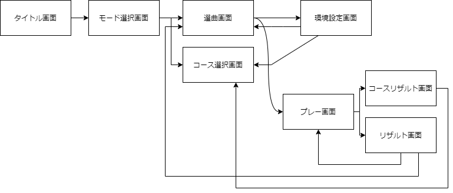

# ゲーム仕様

## 1. 概要

BillionSequencer全体の概要です。

### 1.1.  ゲームモード

BillionSequencerには以下の2つのモードがあります。

- 単曲プレーモード  - フリープレー
- 連続プレーモード - コースモード

#### 1.1.1. 単曲プレーモード - フリープレイ

このモードはプレイヤーがBillionSequencerによって読み込まれた譜面のうち一つを選んでプレーするモードです。

#### 1.1.2. 連続プレーモード - コースモード

このモードは任意に作成された譜面のリストに沿って連続してプレーするモードです。

### 1.2. 画面

BillionSequencerには以下の画面が存在します。

- タイトル画面
- モード選択画面
- 選曲画面
- コース選択
- プレー画面
- リザルト画面
- コースリザルト画面
- 環境設定画面

#### 1.2.1. タイトル画面

ゲームを起動して最初に表示される画面です。

#### 1.2.2. モード選択画面

`1.1. ゲームモード`で述べたゲームモードを選択する画面です。

#### 1.2.3. 選曲画面

`1.2.2. モード選択画面`でフリープレイを選択した場合に表示される画面です。

BillionSequencerが認識している譜面全てのリストが表示され、特定の操作によってプレーする譜面を選択することができます。また、この画面では後述するプレーオプションのカスタマイズができます。

このリストはソートおよびフィルタリングが可能です。

#### 1.2.4. コース選択

`1.2.2. モード選択画面`でコースモードを選択した場合に表示される画面です。

任意に作成された譜面のリストすべてが表示され、特定の操作によってプレーする譜面を選択することができます。また、この画面でも`1.2.3. 選曲画面`と同様にプレーオプションのカスタマイズができます。

#### 1.2.5. プレー画面

`1.2.3. 選曲画面`および`1.2.4. コースモード`で譜面およびリストを選択した場合に表示される画面です。

[譜面データ](譜面フォーマット.md)に定義されたノーツが時間経過と共に降ってきて、そのノーツをタイミングよく叩くことによってゲームが進行します。

譜面の最後のノーツが叩かれた、もしくはミスになった時点でプレー終了となります。またこの画面では任意のタイミングでプレーを中断することができます。

#### 1.2.6. リザルト画面

`1.2.5. プレー画面`でのプレーが中断もしくは終了すると表示される画面です。

プレーの成績として、以下の情報が表示されます。

- 楽曲名
- アーティスト
- スコア
- プレー精度

#### 1.2.7. コースリザルト画面

`1.2.4 コースモード`の場合は、リストに登録されている譜面をすべてプレー、もしくは中断すると表示される画面です。

表示される内容は`1.2.6. リザルト画面`に準じます。

#### 1.2.8. 環境設定画面

`1.2.3. 選曲画面`および`1.2.4. コースモード`のプレーオプションをカスタマイズする画面から遷移できる画面です。

ゲームの基本設定が行えます。

#### 1.2.9. 画面遷移図

## 2. 画面詳細仕様

### 2.1. タイトル画面

`1.2.1. タイトル画面`に準じます。

### 2.2. モード選択画面

`1.2.2. モード選択画面`に準じます。

### 2.3. 選曲画面

画面右側にドラムロールで表現される楽曲リストが1つ存在します。また楽曲リストは楽曲を選択していることを表すカーソルを1つ持ちます。

このカーソルは上下に移動させる操作に対応する入力を行うことによって選択されている楽曲を切り替えることができます。楽曲が選択されている状態で確定する操作に対応する入力を行うとプレー画面に遷移します。

画面左側には選択中の楽曲の名前、アーティスト、難易度、レベル、BPM、譜面制作者、達成した最高スコアが表示されます。

またこの画面に表示されるリストは以下のようにソートが可能です。

- 名前順
- アーティスト順
- スコア順
- BPM

さらにこの画面は以下の条件でフィルタリングが可能です。

- 該当する名前
- アーティスト名
- スコア
- BPM

上記のソート・フィルタリングとは別にフォルダ階層モードが存在し、このモードではBillionSequenceによって読み込まれた楽曲のフォルダ構成がそのまま表示されます。

またこの画面では、プレーオプションをカスタマイズすることができます。

### 2.4. コース選択画面

画面右側にドラムロールで表現されるコースリストが1つ存在します。またコースリストは楽曲を選択していることを表すカーソルを1つ持ちます。

このカーソルは上下に移動させる操作に対応する入力を行うことによって選択されている楽曲を切り替えることができます。コースが選択されている状態で確定する操作に対応する入力を行うとプレー画面に遷移します。

画面左側には選択中の楽曲のコース名、コース制作者、達成した最高スコアが表示されます。

### 2.5. プレー画面

このゲームの中核となる画面です。

画面上部には時間の経過を表すバーが存在します。右端が譜面の終端を表します。

画面左上にはスコアが表示されます。また、どれだけタイミングよく叩けたかの表示は画面下部に表示されます。

### 2.6. リザルト画面

`1.2.6. リザルト画面`に準じます。

### 2.7. コースリザルト画面

`1.2.7. コースリザルト画面`に準じます。

### 2.8. 環境設定画面

この画面では、

- 音量設定
- 入力方式設定
- SE設定
- オフセット設定

が設定できます。

#### 2.8.1. 音量設定

0を消音状態、100を最大の音量とした場合の相対的な音量設定。最終的に出力される音量はシステムの設定に依存します。

#### 2.8.2. 入力方式設定

ゲームプレイの入力方式を設定、または切り替えることができます。現在キーボード操作のみに対応しています。

#### 2.8.3. SE設定

ゲーム内のSEを再生するかどうか設定できます。

#### 2.8.4 オフセット設定

譜面の再生および入力の判定に用いられるオフセットを設定することができます。

## 3. ゲーム詳細仕様

### 3.1. フレーム数

このゲームは1秒間に60回の画面更新を行います。

### 3.2. 判定

降ってきたオブジェクトに対応する操作のタイミング（以下X）が、本来のタイミングと比較した際にどれだけ離れているかを判定します。本来のタイミングとの差はフレーム数で表されます。

判定のしきい値は[譜面](./譜面フォーマット.md)の`global_configurations.required_precision_for_judgement`によって変動します。判定と各`global_configurations.required_precision_for_judgement`のしきい値の対応をいかに示します。

| 判定     | low    | medium | high  | extremely_high |
| -------- | ------ | ------ | ----- | -------------- |
| AWAY     | X<=126 | X<=108 | X<=90 | X<=72          |
| FLAWED   | X<=104 | X<=88  | X<=72 | X<=56          |
| PASSING  | X<=90  | X<=76  | X<=62 | X<=48          |
| BETTER   | X<=68  | X<=56  | X<=44 | X<=32          |
| FLAWLESS | X<=54  | X<=44  | X<=34 | X<=24          |
| BEST     | X<=40  | X<=32  | X<=24 | X<=16          |

BETTER以上でコンボが継続します。

### 3.3. スコア

`譜面に定義されているすべてのノーツの数*3`が、その譜面で達成できる最高のスコアとなります。

最良判定で獲得できるスコアを3とした時、それより下位の判定では獲得できるスコアが低くなります。

| 判定     | 獲得スコア |
| -------- | ---------- |
| AWAY     | 0          |
| FLAWED   | 0          |
| PASSING  | 0          |
| BETTER   | 1          |
| FLAWLESS | 2          |
| BEST     | 3          |

### 3.4. ゲージ

スコアとは別に、譜面のクリアを表現するための、0から100の間を取る実数値です。2種類存在します。

#### 3.4.1. 増加型ゲージ

譜面再生開始時に0に設定され、タイミングよく叩けば叩くほど増えていくゲージです。85.0より大きい値であればクリアと扱われます。

##### 3.4.1.1. ゲージ増減量

ゲージ増減量は[譜面の設定](./譜面フォーマット)と判定に依存します。

| 判定     | ゲージ増減量                                                 |
| -------- | ------------------------------------------------------------ |
| AWAY     | -6.0                                                         |
| FLAWED   | -3.5                                                         |
| PASSING  | 0                                                            |
| BETTER   | `global_configurations.gauge_replenishment_base_amount`/全てのノーツの数*0.5 |
| FLAWLESS | `global_configurations.gauge_replenishment_base_amount`/全てのノーツの数*0.75 |
| BEST     | `global_configurations.gauge_replenishment_base_amount`/全てのノーツの数 |

#### 3.4.2. 減少型ゲージ

##### 3.4.2.1. ゲージ増減量

譜面再生開始時に100に設定され、ノーツをタイミングよく叩くと増え、ミスをすると減っていくゲージです。ゲーム終了時に0より大きい値であればクリアと扱われます。

ゲージ増減量は判定のみに依存します。

| 判定     | ゲージ増減量 |
| -------- | ------------ |
| AWAY     | -15.0        |
| FLAWED   | -8.0         |
| PASSING  | 0.0125       |
| BETTER   | 0.025        |
| FLAWLESS | 0.05         |
| BEST     | 0.1          |

### 3.5. 精度

精度は`(BEST判定の数*3+FLAWLESS判定の数*2+BETTER判定の数)/(譜面に定義されているすべてのノーツの数*2)*100`で示され、最高で100.0、最低で0.0となります。
